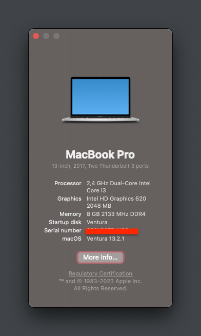
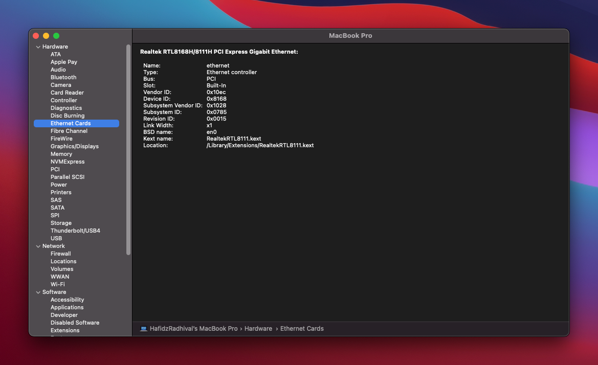
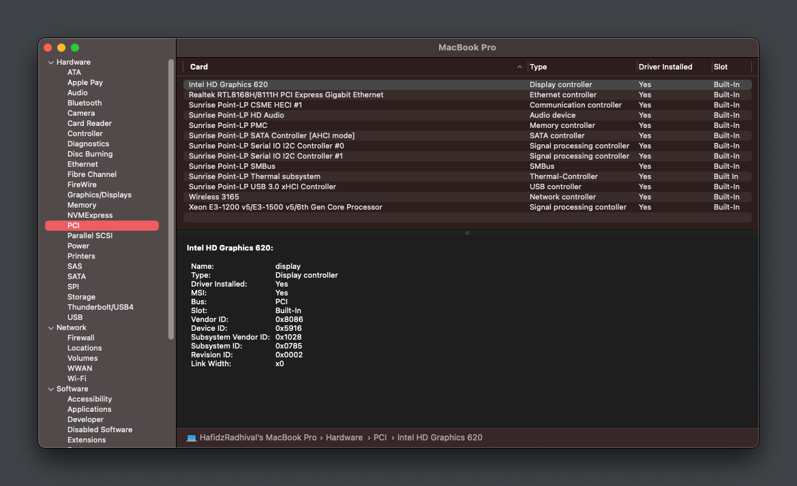
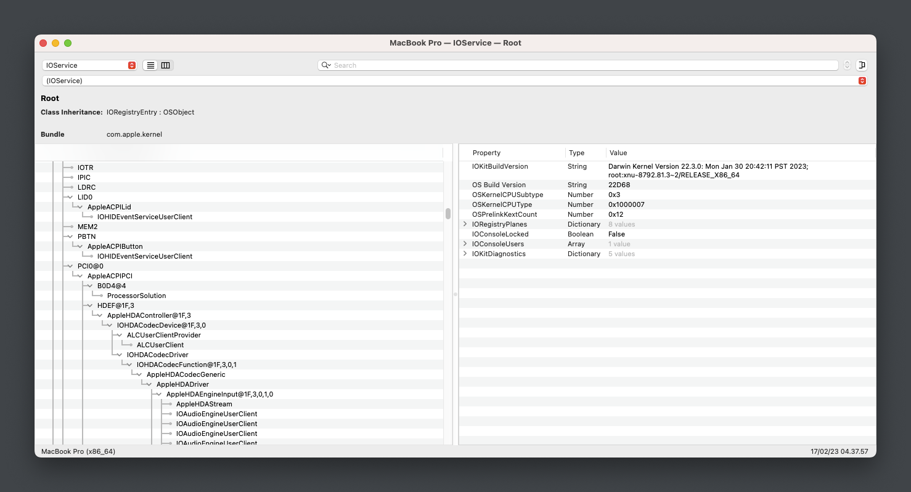
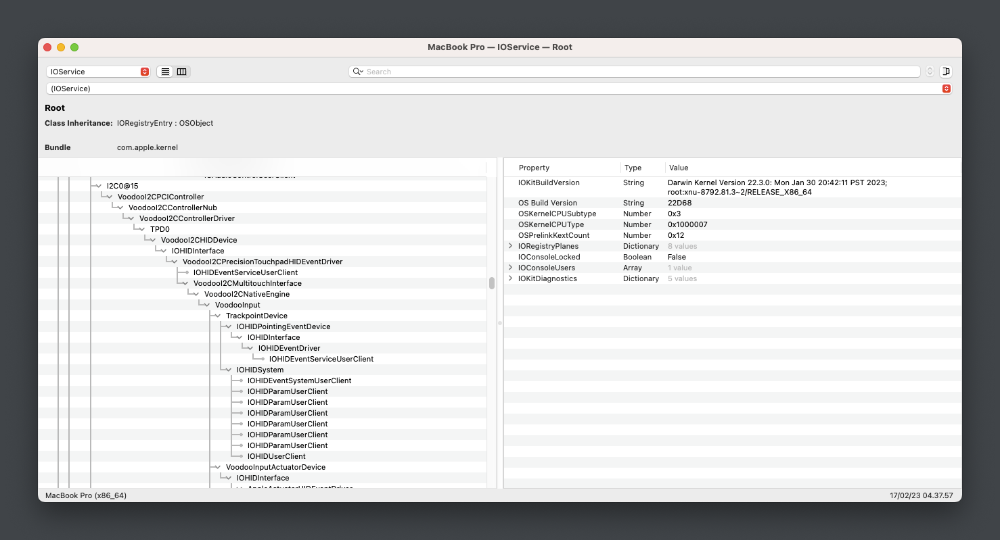
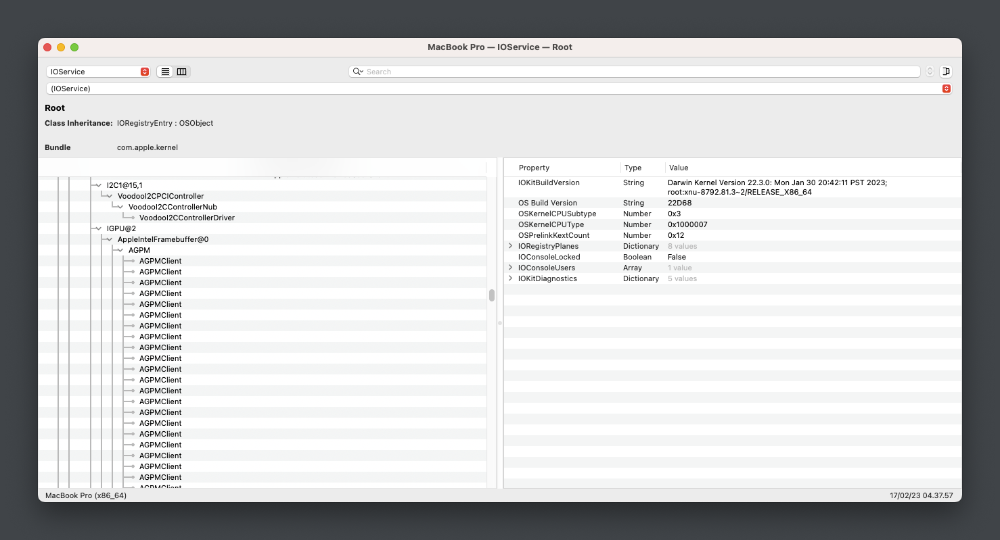
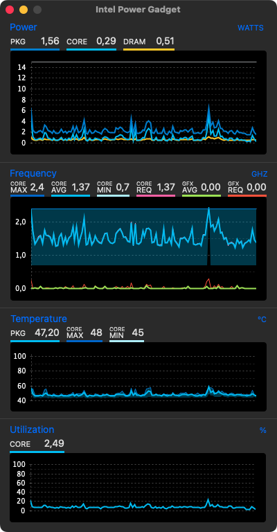
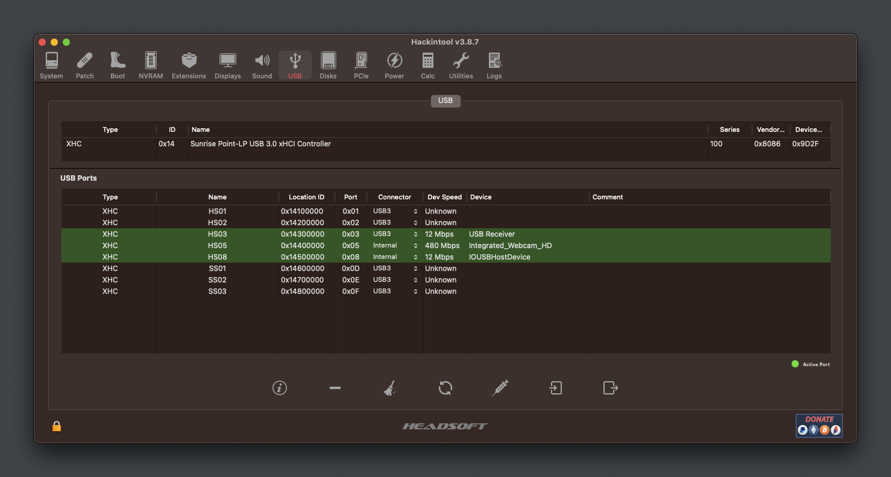

# Hackintosh-DELL-Vostro-5468

macOS Monterey

* macOS:
  - Monterey 12.0.2 ✅
* Windows:
  - Windows 11 ✅
* Bootloader: OpenCore 0.7.8.
* EFI can be used for both for installation and booting from SSD.

## Introduction

  

<strong>System Overview</strong>

 

**Dell Vostro-14 5468**

| Type | Item |
| ---- | ---- |
| CPU | Intel Core i3-7100U @ 2.40 GHz, 3M Cache |
| RAM | Samsung 8GB DDR4-2133MHz |
| SSD1 | Digital Alliance 128GB M.2 SATA III |
| HDD2 | Western Digital WD5000LPCX 500GB SATA Hard Drive |
| Sound | Realtek ALC256 |
| Wireless, Bluetooth | Intel 3165 |
| Integrated GPU | Intel HD Graphics 620 |

  

<strong>Current Status</strong>

 

| Feature | Status |
| ------------- | ------------- |
| CPU Power Management | ✅ Working |
| Sleep/Wake | ✅ Working |
| Intel HD620 Graphics Acceleration | ✅ Working |
| Intel Quartz Extreme and Intel Core Image (QE/CI) | ✅ Working |
| Brightness control slider | ✅ Working |
| Special function keys (audio, brightness...) | ✅ Working |
| Ethernet | ✅ Working |
| Audio | ✅ Working |
| Touchpad | ✅ Working |
| Battery | ✅ Working |
| iMessage/Facetime and App Store | ✅ Working  |
| Speakers and Headphones | ✅ Working |
| Built-in Microphone | ✅ Working |
| Webcam | ✅ Working |
| Wi-Fi/Bluetooth | ✅ Working |
| Hibernation | ✅ Working |
| FileVault | ✅ Working |
| Airdrop/Handoff | [-] Not Tested |
| BootCamp | [-] Not Tested |
| SD Card | ❌ [-] Not Tested |
| Fingerprint reader | ❌ Not working |

## Installation

  

<strong>BIOS Configuration</strong>

 

**Recommend you should restore the BIOS setting to BIOS Setting first. Then configure the following things:**

  | Sub-menu | Key: Value | Comment |
  | --- | --- | --- |
  | UEFI Boot Path Security | `Disabled` | |
  | Enable Legacy Option ROMs | `Disabled` | Disable will help OpenCanopy load faster |
  | SATA Operation | `AHCI` | |
  | Enabled USB Boot Support | `Enabled` | |
  | Enable External USB Port | `Enabled` | |
  | Secure Boot | `Disabled` | Can set to `Enabled` if you have already custom secure boot keys and signed OpenCore binaries |
  | Wake on USB | `Enabled` | Wake from keyboard works correctly | |

<strong>Mainly Configuration</strong>

### Graphic Display
* Integrated Intel HD Graphics 620 support is handled by WhateverGreen, and configured in the `DeviceProperties` section of `config.plist`.

### Audio
* For ALC256 on this my Machine, I use `layout-id = 56`.
* Without any modifications, the headphone jack is buggy. External microphones aren't detected and the audio output may randomly stop working or start making weird noises.
* Start from this version, I change to use `ALCPlugFix`. It gives better sound experience and performance when using the headset/headphone.

<strong>Other Configuration</strong>

### Wireless, Bluetooth
* The stock Intel AC 3165 can be worked well with [OpenIntelWireless](https://github.com/OpenIntelWireless).

### Sleep, Wake and Hibernation
* Hibernation now is works with GPRW Patch and support for native macOS `hibernatemode3`
* Config in Terminal :
 - `sudo pmset powernap 0`
 - `sudo pmset proximitywake 0`
 - `sudo pmset standby 0`
 - `sudo pmset tcpkeepalive 0`
 - `sudo pmset lidwake 0`

### Keyboard, Trackpad and Magic Trackpad
- Look up & data detectors
- Secondary click (with two fingers, in bottom left corner*, in bottom right corner*)
- Tap to click
- Scrolling
- Zoom in or out
- Smart zoom
- Etc ...
- `Dont forget to make setting in Sleep and Wake on Terminal`

### CPU Power Management
* Native CPU Power Management

<strong>iServices</strong>

* To use iMessage and other Apple services, you need to generate your own serial numbers. This can be done using [CorpNewt's GenSMBIOS](https://github.com/corpnewt/GenSMBIOS). Make sure model is `MacBookPro15,1`. Then, go [Apple Check Coverage page](https://checkcoverage.apple.com/) to check your generated serial numbers. If the website tells you that the serial number **is not valid**, that is fine. Otherwise, you have to generate a new set.

* Next you will have to copy the following values to your `config.plist`:
  - Serial Number -> `PlatformInfo/Generic/SystemSerialNumber`.
  - Board Number -> `PlatformInfo/Generic/MLB`.
  - SmUUID -> `/PlatformInfo/Generic/SystemUUID`.
  Reboot and Apple services should work.

* If they don't, follow [this in-depth guide](https://dortania.github.io/OpenCore-Post-Install/universal/iservices.html). It goes deeper into ROM, clearing NVRAM, clearing Keychain (missing this step might cause major issues), and much more.

  

<strong>Kext Docs</strong>

 

* AirportItlwm.kext: Intel AC 3165 Wirelless
* AppleALC.kext: Enable Audio with layout-id=56
* BlueToolFixup.kext: Enable Bluetooth
* RealtekCardReader.kext: [Maybe fixed CardReader, because not tested now]()
* Lilu.kext: Kernel extension bringing a platform for arbitrary kext, library, and program patching throughout the system for macOS
* PropertyInjector.kext: Property Inject for Sunrise Thermal Subsystem
* RealtekRTL8111.kext: Driver Ethernet for the Realtek RTL8111/8168 family
* ThermalSolution.kext: driver for Signal Processing Controller for Intel(R) Xeon ( now IETM and B0D4 devices are correctly attached as reported by IORegistryExplorer ) 
* USBMap.kext: For Mapping USB Port
* VoodooI2C: Fix Trackpad
* VirtualSMC.kext: Advanced Apple SMC emulator in the kernel
* VoodooPS2Controller.kext: Enable Keyboard and Touchpad
* WhateverGreen.kext: Lilu plugin providing patches to select GPUs on macOS

<strong>SSDT Patch Docs</strong>

 

* ALS0: Enable light sensor
* EC-USBX: Fake embedded controller and fix USB power properties
* HPET: Fixing IRQ Conflicts
* PNLF: Fix brightness control
* SMBUS-MCHC: Fixing SMBus support
* USB-Reset: Reset All Detected Ports and hit discover ports
* XOSI: fixing I2C trackpads is enabling them within ACPI
* BRT6: Fix Mapping Brightness Keys
* CPU-PM: For Native CPU Power Management
* DMAC: Direct Memory Access Control
* MEM2: Expanded Memory Option
* PMCR: Power Management Capabilities Register
* PWRB: Power Sleep Button
* SLPB: Sleep Button Device
* GPI0: Pinning I2C Trackpad
* GPRW: For Fix Sleep/LID/Hibernate
* `Now All SSDT* make to SSDT-HFDZ for make Simple`
* You Can See Configuration SSDT from [Dortania](https://dortania.github.io/OpenCore-Post-Install/#how-to-follow-this-guide)

<strong>Screenshot</strong>

 

* [UPDATE]

*[UPDATE USBMap Manual from DORTANIA]

## Credit
- [Apple](https://apple.com) for macOS;
- [Acidanthera](https://github.com/acidanthera) for OpenCore and all the lovely hackintosh work.
- [Dortania](https://github.com/dortania) For their detailed guides.
- [Olarila](Olarila.com) For Installer
- Etc ...
