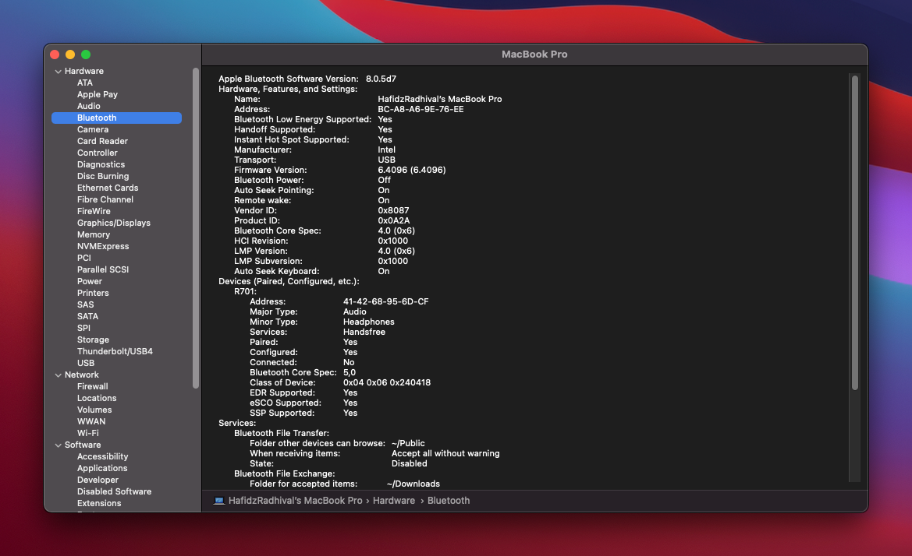
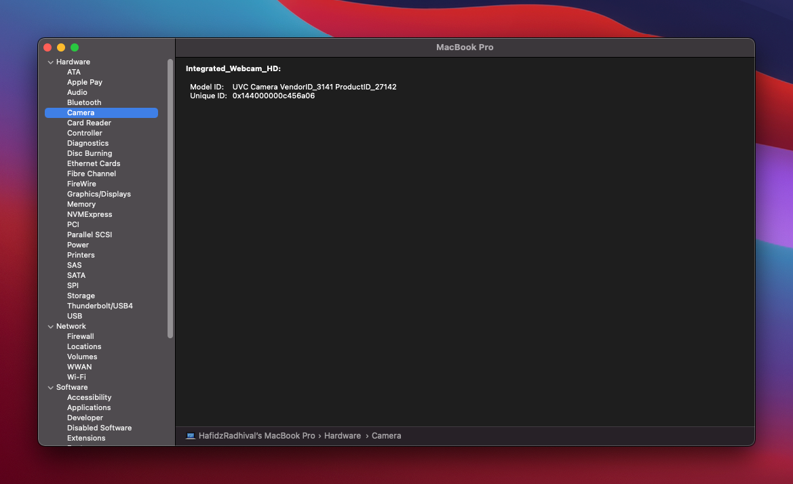
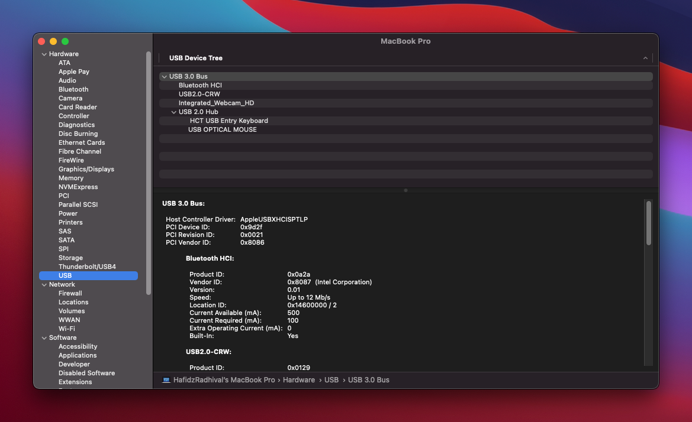
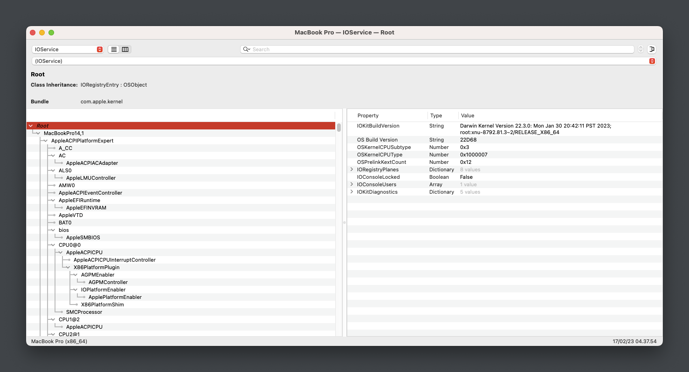
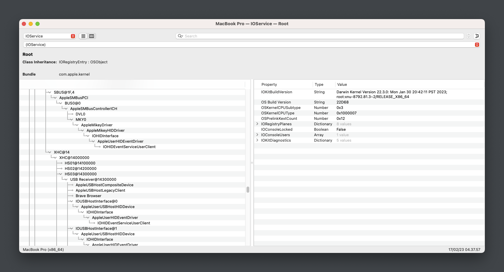
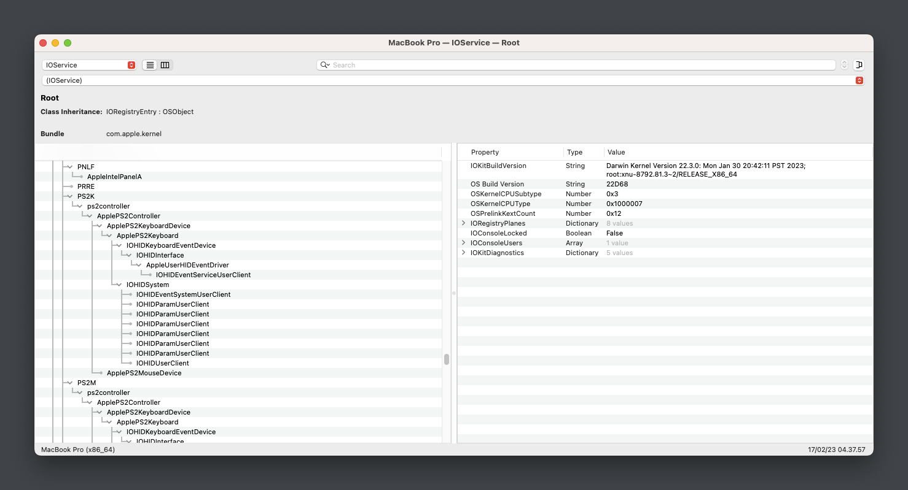
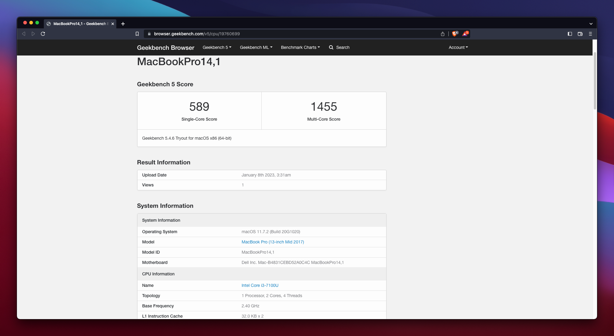
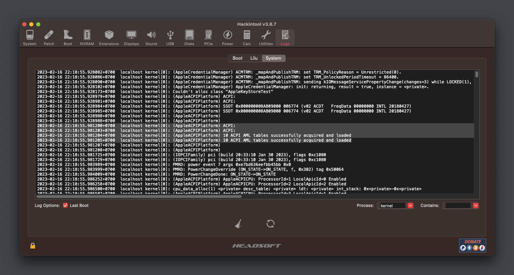

# Hackintosh-DELL-Vostro-5468

macOS Ventura 13.2

* macOS:
  - macOS Ventura 13.2 ✅
* Windows:
  - Windows 11 ✅
* Bootloader: OpenCore MOD 0.8.9
* EFI can be used for both for installation and booting from SSD.

## Introduction

<strong>System Overview</strong>

 

**Dell Vostro-14 5468**

| Type | Item |
| ---- | ---- |
| CPU | Intel Core i3-7100U @ 2.40 GHz, 3M Cache |
| RAM | Samsung 8GB DDR4-2133MHz |
| SSD1 | Digital Alliance 128GB M.2 SATA III |
| HDD2 | Western Digital WD5000LPCX 500GB SATA Hard Drive |
| Sound | Realtek ALC256 |
| Wireless, Bluetooth | Intel 3165 |
| Integrated GPU | Intel HD Graphics 620 |

<strong>Current Status</strong>

 

| Feature | Status |
| ------------- | ------------- |
| CPU Power Management | ✅ Working |
| Sleep/Wake | ✅ Working |
| Intel HD620 Graphics Acceleration | ✅ Working |
| Intel Quartz Extreme and Intel Core Image (QE/CI) | ✅ Working |
| Brightness control slider | ✅ Working |
| Special function keys (audio, brightness...) | ✅ Working |
| Ethernet | ✅ Working |
| Audio and HDMI Audio | ✅ Working |
| Multi-Touch Trackpad | ✅ Working |
| Battery | ✅ Working |
| iMessage/Facetime and App Store | ✅ Working  |
| Speakers and Headphones | ✅ Working |
| Built-in Microphone | ✅ Working |
| Webcam | ✅ Working |
| Wi-Fi/Bluetooth | ✅ Working |
| Hibernation | ✅ Working |
| FileVault | ✅ Working |
| ClamShell | ✅ Working |
| BootCamp | [-] Not Tested |
| Airdrop/Handoff | ❌ Not Working |
| SD Card | ❌ Not Working (Disable) |
| Fingerprint reader | ❌ Not Working (Disable) |

## Installation

<strong>BIOS Configuration</strong>

 

**Recommend you should restore the BIOS setting to BIOS Setting first. Then configure the following things:**

  | Sub-menu | Key: Value | Comment |
  | --- | --- | --- |
  | UEFI Boot Path Security | `Disabled` | |
  | Enable Legacy Option ROMs | `Disabled` | Disable will help OpenCanopy load faster |
  | SATA Operation | `AHCI` | |
  | Enabled USB Boot Support | `Enabled` | |
  | Enable External USB Port | `Enabled` | |
  | Secure Boot | `Disabled` | Can set to `Enabled` if you have already custom secure boot keys and signed OpenCore binaries |
  | Wake on USB | `Enabled` | Wake from keyboard works correctly | |

<strong>Mainly Configuration</strong>

### Graphic Display
* Integrated Intel HD Graphics 620 support is handled by WhateverGreen, and configured in the `DeviceProperties` section of `config.plist`.

### Audio
* For ALC256 on this my Machine, I use `layout-id = 12` (Patched on DSDT).
* Without any modifications, the headphone jack is buggy. External microphones aren't detected and the audio output may randomly stop working or start making weird noises.
* Start from this version, I change to use [`MicFix`](https://github.com/WingLim/MicFix). It gives better sound experience and performance when using the headset/headphone.

<strong>Other Configuration</strong>

### Wireless, Bluetooth
* The stock Intel AC 3165 can be worked well with [OpenIntelWireless](https://github.com/OpenIntelWireless).

### Sleep, Wake and Hibernation
* Config in Terminal ( Optional ) :
 - `sudo pmset powernap 0`
 - `sudo pmset proximitywake 0`
 - `sudo pmset standby 0`
 - `sudo pmset tcpkeepalive 0`
 - `sudo pmset lidwake 0`
* NOTE: please use powernap 0 to fix itlwm try reconnect many times.

### Keyboard, Trackpad and Magic Trackpad
- Look up & data detectors
- Secondary click (with two fingers, in bottom left corner*, in bottom right corner*)
- Tap to click
- Scrolling
- Zoom in or out
- Smart zoom
- Enable Drag and Drop use Clickpad: Some trackpad settings have been moved on 10.12+, this is the case for tap to drag. Navigate to the Accessibility PrefPane. On the left, select 'Mouse & Trackpad' and then 'Trackpad Option'. Here you must select 'Enable Drag' and set "Without drag lock"
- Etc ...

### CPU Power Management
* Native CPU Power Management

### Disable CFG Lock
* Removing the CFG Lock enables better compatibility with Mac and better CPU and power management

* For set CFG LOCK Disabled `setup_var 0x4DE 0x0` in [modGRUBShell.efi](https://github.com/datasone/grub-mod-setup_var/releases)
* After this mod set false the quirks AppleXcpmCfgLock

<strong>iServices</strong>

* To use iMessage and other Apple services, you need to generate your own serial numbers. This can be done using [CorpNewt's GenSMBIOS](https://github.com/corpnewt/GenSMBIOS). Make sure model is `MacBookPro14,1`. Then, go [Apple Check Coverage page](https://checkcoverage.apple.com/) to check your generated serial numbers. If the website tells you that the serial number **is not valid**, that is fine. Otherwise, you have to generate a new set.

* Next you will have to copy the following values to your `config.plist`:
  - Serial Number -> `PlatformInfo/Generic/SystemSerialNumber`.
  - Board Number -> `PlatformInfo/Generic/MLB`.
  - SmUUID -> `/PlatformInfo/Generic/SystemUUID`.
  Reboot and Apple services should work.

* If they don't, follow [this in-depth guide](https://dortania.github.io/OpenCore-Post-Install/universal/iservices.html). It goes deeper into ROM, clearing NVRAM, clearing Keychain (missing this step might cause major issues), and much more.

<strong>Kext Docs</strong>

 

* AirportItlwm.kext: Intel AC 3165 Wireless
* AppleALC.kext: Enable Audio with layout-id=12
* BlueToolFixup.kext: Enable bluetooth in Ventura (if you on BigSur you can remove this, because Native on Big Sur)
* CPUFriend.kext : For handle cpu-frequency data providing patch CPU-Frequency_data from CPUFriend
* IntelBluetoothFirmware.kext : For load Intel Bluetooth Firmware. (See on Hackintool)
* Lilu.kext: Kernel extension bringing a platform for arbitrary kext, library, and program patching throughout the system for macOS
* PropertyInjector.kext and ThermalSolution.kext: Inject Thermal Subsystem
* RealtekRTL8111.kext: Driver Ethernet for the Realtek RTL8111/8168 family
* VoodooI2C and VoodooI2CHID: Fix Trackpad, pair with extension VoodooI2CHID.kext
* VirtualSMC.kext: Advanced Apple SMC emulator in the kernel
* VoodooPS2Controller.kext: Enable Keyboard and Touchpad
* WhateverGreen.kext: Lilu plugin providing patches to select GPUs on macOS
<!-- * VerbStub.kext: for Handle ComboJack ( Headphone Fix ) -->

<strong>DSDT Patch Docs</strong>

 

* Fix _WAK Arg0 v2 : For wake from sleep to turn on various.
* HPET : Patches out IRQ conflicts.
* SMBUS : Adds missing SMBUS (Intel System Management Bus) device to the system.
* Mikey : Added AppleMikeyDriver under SMBUS
* IRQ Fix : Fixes non-working audio on certain OEM (Dell, HP) machines.
* RTC : Fix the system clocks found on newer hardware.
* Fix Mutex with non-zero SyncLevel : Fixes Failed Battery Status and other related issues.
* Add MCHC : Adds missing MCHC Device.
* Patch USB_7/8 series : Injects Power Properties for USB.
* Sb_prw_0x6d (instant wake) : To fix the sleep/wake function.
* Dmac : Adds a DMA Controller to the LPCB (Low Pin Count Bus).
* Dtgp : Method that passes through calls to _DSM methods on various Device objects.
* Slpb : Fix sleep power button.
* Als0 : Add Fake Ambient Light Sensor.
* Pnlf : Fix Brightness Slider.
* Cpu power management : Fix power management CPU-Frequency.
* Brightness keys : Fix brightness keyss up and down.
* Audio patch : Patch layout-id audio in DSDT.
* USB Patch Native without Kext/Injector.
* _PLD Buffer/Package : For return a variable length Package of Buffers.
* Fix PNOT/PPNT	: Dropping OEM CPU-related SSDTs.
* Fix ADBG Error.
* OS Check Fix.
* Possible operator timeout is ignored patch.
* Cleanup unused code.
* Fix Waning and Error code.
* USBX.
* B0D4.
* HDAU.
* XSPI.

<strong>Screenshot</strong>

 

- New Update CPU Management After One Day Use 

- New Update USB Port Mapping 

- New Update Cleanup Unused Code DSDT 

- New Update load Intel Bluetooth Firmware 

- Now No ACPI Error or Duplicated !! 

- New Update CPU Management Idle !! 

- Geekbench5 Benchmark 

- Clean Warning on DSDT Patch 

## Credit
- [Apple](https://apple.com) for macOS;
- [Acidanthera](https://github.com/acidanthera) for OpenCore and all the lovely hackintosh work.
- [Dortania](https://github.com/dortania) For their detailed guides.
- [Olarila](Olarila.com) For Installer
- Etc ...
